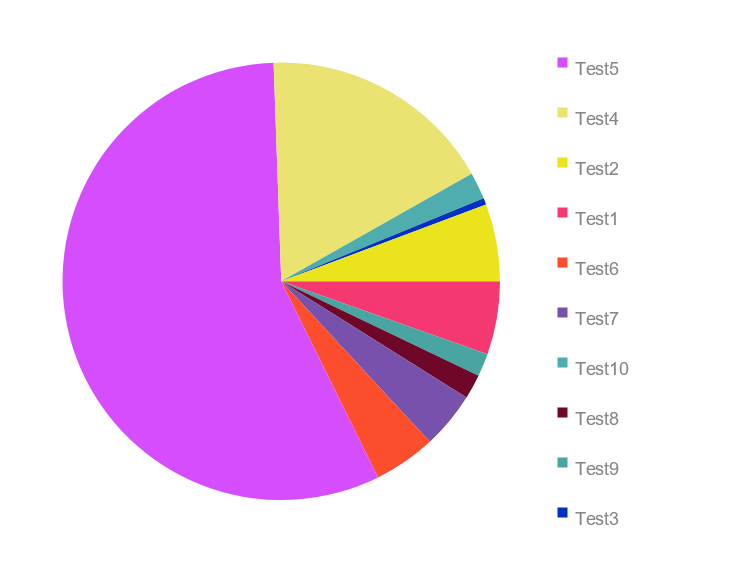
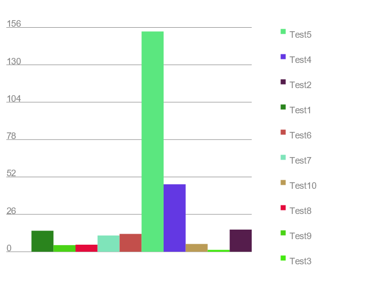
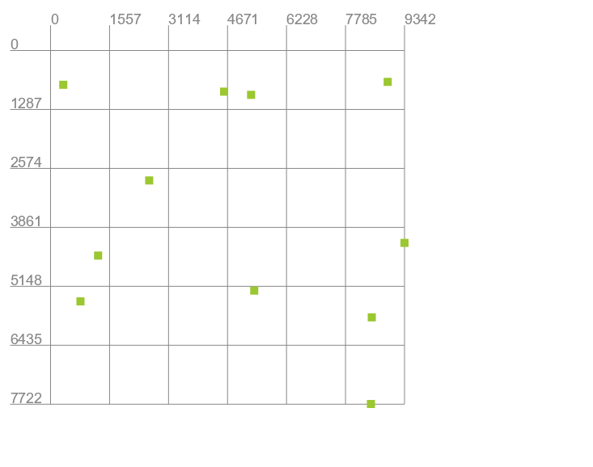

# Утилита AmEl VIZ

### Описание

Данная утилита позволяет визуализировать данные из [key-value](https://en.wikipedia.org/wiki/Key%E2%80%93value_database)
БД расширения `.amel`.
<br>
**Ключ уникален**

### Диаграммы

Данные из файла можно представить в виде следующих диаграмм (в легенде отображается определенное количество наибольших
значений):

* Круговая диаграмма (```CDG data/Test10.amel CircleDiagram.png```)<br> 
* Гистограмма (```HG data/Test10.amel Histogram.png```)<br> 
* Диаграмма рассеяния (```SP data/NumNum10.amel ScatterPlot.png```)<br> 

### Команды

Для того чтобы получить визуализированное представление данных, нужно ввести запрос, используя команды ниже:

#### CDG (Circle Diagram)

    CDG <File> <ImageToSave>

**CDG** - команда, которая визуализирует данные из ```<File>``` в виде __круговой диаграммы__ и сохраняет ее
в ```<ImageToSave>```

#### HG (Histogram)

    HG <File> <ImageToSave>

**HG** - команда, которая визуализирует данные из ```<File>``` в виде __гистограммы__ и сохраняет ее
в ```<ImageToSave>```

#### SP (Scatter Plot)

    SP <File> <ImageToSave>

**SP** - команда, которая визуализирует данные из ```<File>``` в виде __диаграммы рассеяния__ и сохраняет ее
в ```<ImageToSave>```

**Для данной команды должна использоваться БД следующей струтуры: ```Число: число```**
